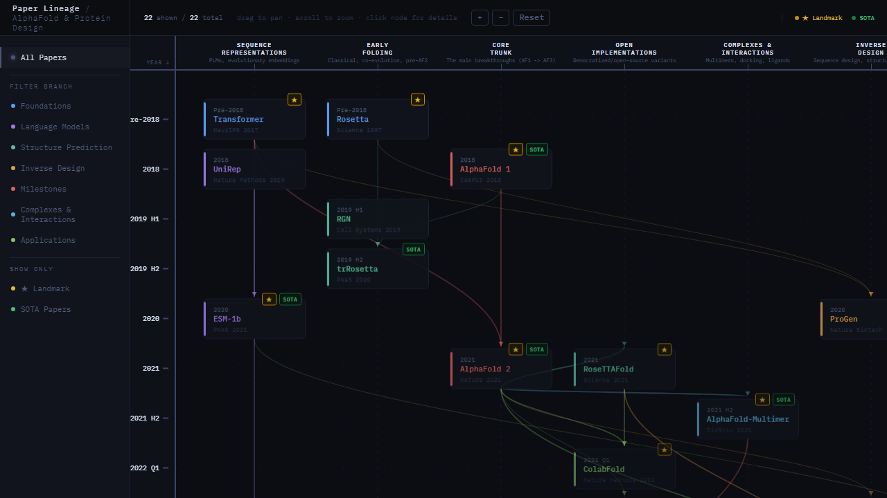

# Okay-Skills

This repository is **Okay-Skills**: a collection of actionable skills (instructions, templates, and workflows) designed for Claude Code and other AI assistants. By pointing the assistant to the respective skill files, it can naturally adopt specialized behaviors and perform complex, multi-step domain tasks. *There will be more skills to come!*

## Installation

You can easily add a skill using `npx skills add`. For example, to add the `paper-tree` skill:

```bash
npx skills add https://github.com/TONiiV/okay-skills --skill paper-tree
```

## Repository Structure

- `skills/`
  Contains individual skill directories. Each skill is self-contained with a `SKILL.md` (the main instruction document), a `REFERENCE.md` (for domain-specific knowledge), and any necessary templates or assets.
  - **`paper-tree`**: A skill that empowers the assistant to generate fully interactive, beautifully laid-out HTML paper lineage trees for any academic field.
  
  

- `tests/`
  Contains evaluation scripts and unit tests to ensure that the outputs correctly adhere to the guidelines and templates defined in the skills. Tests help verify robustness, output reliability, and skill accuracy.


## Usage

To use a particular skill manually, reference its `SKILL.md` and any associated contextual files directly in your prompt to the AI assistant. 
For example, to use the `paper-tree` skill, you simply run a prompt similar to:
`"Use @[skills/paper-tree/SKILL.md] to draw a lineage tree for Diffusion Models."`

## Testing

When developing or modifying skills, run the tests available in the `tests/` directory to ensure you haven't broken the skill logic or expected output structures.
